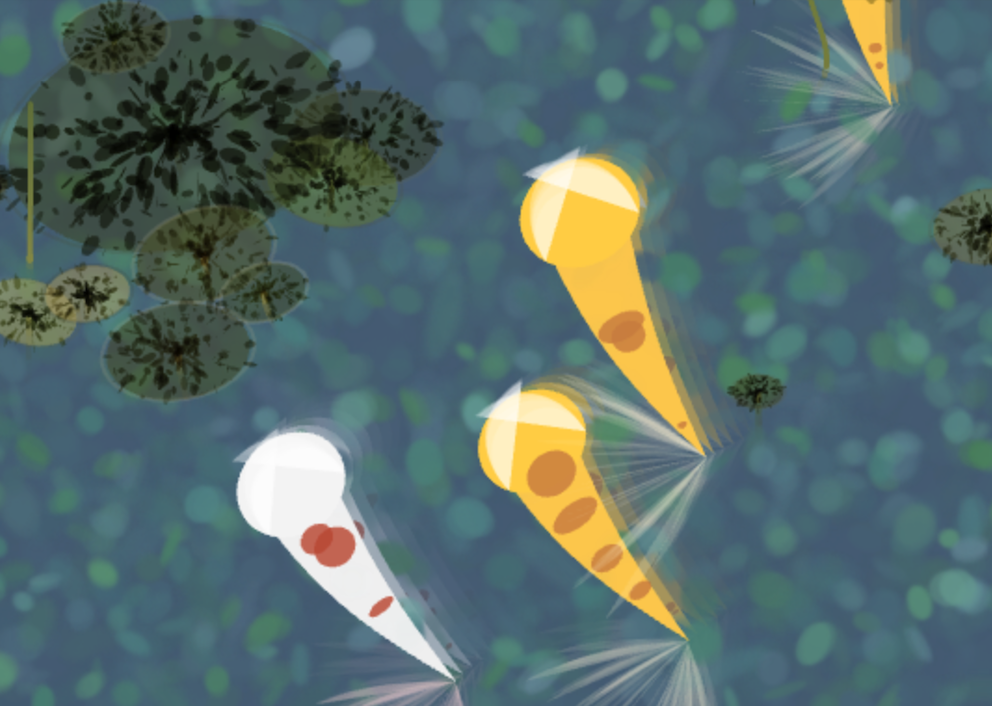

**Usage**
- Click “Clear Seed” to generate a completely new random pond.
- Or, type any number into the Seed box and press “Load Seed” to recreate or explore variations.
- Click “Share Pond” to copy a URL that embeds your current seed —
anyone opening that link will see your exact pond configuration.
- Click “Save Image” to download your pond as a PNG file, named with your seed for easy sharing.

**My A Priori Artifact**

This pond was the a priori artifact
From this composition, i explored more variations of the fish, the water, and other details. i also experimented with different color palettes.

**AI Use**

ChatGPT assisted with:

- Refactoring the original single-file sketch into modular files (`draw.js`, `object.js`, `fish.js`, etc.) for clarity and maintainability.
- Debugging rendering issues
- Guidance for implementing specific techniques to achieve painting like effect like water effects and layering techniques
- Designing functions `drawPetalStroke()`, `drawLilyFlower()`, `drawFish()` to emulate painterly brush strokes and natural variation. Designing helper functions for converting colors/choosing palettes
- Adding interactivity including the feature for seed sharing and image export
